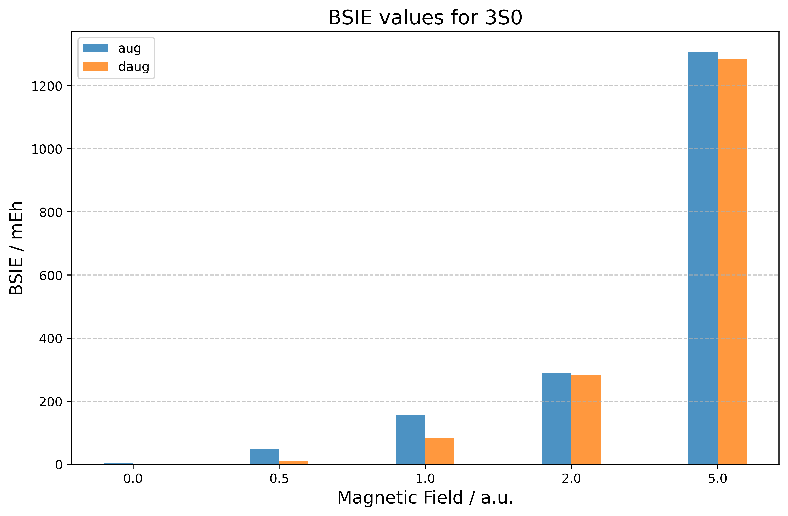

# Introduction {#sec-intro}

This is an example of how to use this template to render journal articles. This template is inspired by the arXiv rticles template for rmarkdown, repurposed for the Quarto publishing system.

This quarto extension format supports PDF and HTML outputs. This template is primarily focused on generating acceptable outputs from Quarto, but renders an acceptable HTML output using the standard Quarto options.

$$
 E[\gamma(\mathbf{r})] = h_\mathrm{core} [\gamma(\mathbf{r})] + J[\gamma(\mathbf{r})] - K[\gamma(\mathbf{r})] 
$$

# Quarto

Quarto enables you to weave together content and executable code into a finished document. To learn more about Quarto see <https://quarto.org>.


# Markdown Basics

This section of the template is adapted from [Quarto's documentation on Markdown basics](https://quarto.org/docs/authoring/markdown-basics.html).

## Text Formatting

+-----------------------------------+-------------------------------+
| Markdown Syntax                   | Output                        |
+===================================+===============================+
|     *italics* and **bold**        | *italics* and **bold**        |
+-----------------------------------+-------------------------------+
|     superscript^2^ / subscript~2~ | superscript^2^ / subscript~2~ |
+-----------------------------------+-------------------------------+
|     ~~strikethrough~~             | ~~strikethrough~~             |
+-----------------------------------+-------------------------------+
|     `verbatim code`               | `verbatim code`               |
+-----------------------------------+-------------------------------+

## Headings {#headings}

+---------------------+-----------------------------------+
| Markdown Syntax     | Output                            |
+=====================+===================================+
|     # Header 1      | # Header 1 {.heading-output}      |
+---------------------+-----------------------------------+
|     ## Header 2     | ## Header 2 {.heading-output}     |
+---------------------+-----------------------------------+
|     ### Header 3    | ### Header 3 {.heading-output}    |
+---------------------+-----------------------------------+

## Equations

Use `$` delimiters for inline math and `$$` delimiters for display math. For example:

+-------------------------------+-------------------------+
| Markdown Syntax               | Output                  |
+===============================+=========================+
|     inline math: $E = mc^{2}$ | inline math: $E=mc^{2}$ |
+-------------------------------+-------------------------+
|     display math:             | display math:\          |
|                               | $$E = mc^{2}$$          |
|     $$E = mc^{2}$$            |                         |
+-------------------------------+-------------------------+

If assigned an ID, display math equations will be automatically numbered:

$$
\frac{\partial \mathrm C}{ \partial \mathrm t } + \frac{1}{2}\sigma^{2} \mathrm S^{2}
\frac{\partial^{2} \mathrm C}{\partial \mathrm C^2}
  + \mathrm r \mathrm S \frac{\partial \mathrm C}{\partial \mathrm S}\ =
  \mathrm r \mathrm C 
$$ {#eq-black-scholes}

## Other Blocks

+-----------------------------+--------------------------+
| Markdown Syntax             | Output                   |
+=============================+==========================+
|     > Blockquote            | > Blockquote             |
+-----------------------------+--------------------------+
|     | Line Block            | | Line Block             |
|     |   Spaces and newlines | |    Spaces and newlines |
|     |   are preserved       | |    are preserved       |
+-----------------------------+--------------------------+

## Cross-references {#sec-crf}

{#fig-sample-plot}

+---------------------------------------+---------------------------------+
| Markdown Format                       | Output                          |
+=======================================+=================================+
|     @fig-sample-plot is pretty.       | @fig-sample-plot is pretty.   |
+---------------------------------------+---------------------------------+
+---------------------------------------+---------------------------------+
|     @sec-crf is this section.         | @sec-crf is this section.       |
+---------------------------------------+---------------------------------+
|     @eq-black-scholes is above.       | @eq-black-scholes is above.     |
+---------------------------------------+---------------------------------+

See the [Quarto documentation on cross-references for more](https://quarto.org/docs/authoring/cross-references.html).


# Citations

This section of the template is adapted from the [Quarto citation documentation](https://quarto.org/docs/authoring/footnotes-and-citations.html).

Quarto supports bibliography files in a wide variety of formats including BibTeX and CSL. Add a bibliography to your document using the `bibliography` YAML metadata field. For example:

``` yaml
---
title: "My Document"
bibliography: references.bib
---
```

See the [Pandoc Citations](https://pandoc.org/MANUAL.html#citations) documentation for additional information on bibliography formats.

## Citation Syntax {#sec-citations}

Quarto uses the standard Pandoc markdown representation for citations. Here are some examples:


+-------------------------------------------+---------------------------------------------------------------------+
| Markdown Format                           | Output                                                              |
+===========================================+=====================================================================+
|     Blah Blah [see @knuth1984, pp. 33-35; | Blah Blah [see @knuth1984, pp. 33-35; also @wickham2015, chap. 1]   |
|     also @wickham2015, chap. 1]           |                                                                     |
+-------------------------------------------+---------------------------------------------------------------------+
|     Blah Blah [@knuth1984, pp. 33-35,     | Blah Blah [@knuth1984, pp. 33-35, 38-39 and passim]                 |
|     38-39 and passim]                     |                                                                     |
+-------------------------------------------+---------------------------------------------------------------------+
|     Blah Blah [@wickham2015; @knuth1984]. | Blah Blah [@wickham2015; @knuth1984].                               |
+-------------------------------------------+---------------------------------------------------------------------+
|     Wickham says blah [-@wickham2015]     | Wickham says blah [-@wickham2015]                                   |
+-------------------------------------------+---------------------------------------------------------------------+

You can also write in-text citations, as follows:

+-----------------------------------+-------------------------------+
| Markdown Format                   | Output                        |
+===================================+===============================+
|     @knuth1984 says blah.         | @knuth1984 says blah.         |
+-----------------------------------+-------------------------------+
|     @knuth1984 [p. 33] says blah. | @knuth1984 [p. 33] says blah. |
+-----------------------------------+-------------------------------+

See the [Pandoc Citations](https://pandoc.org/MANUAL.html#citations) documentation for additional information on citation syntax.

To provide a custom citation stylesheet, provide a path to a CSL file using the `csl` metadata field in your document, for example:

``` yaml
---
title: "My Document"
bibliography: references.bib
csl: nature.csl
---
```



# References {.unnumbered}

::: {#refs}
:::

